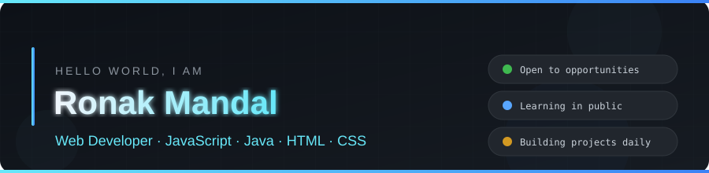
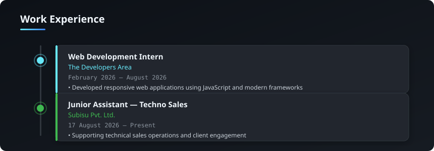
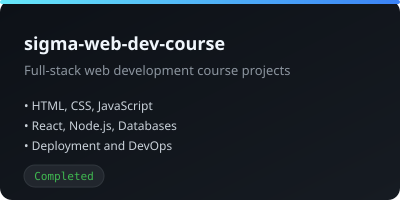
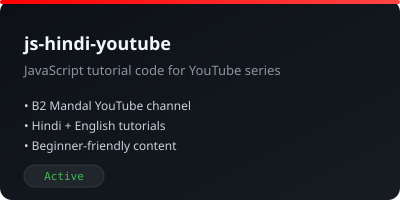
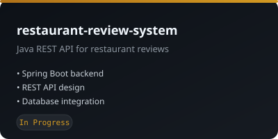
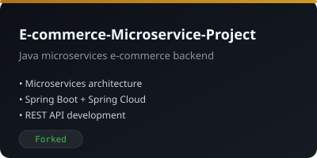
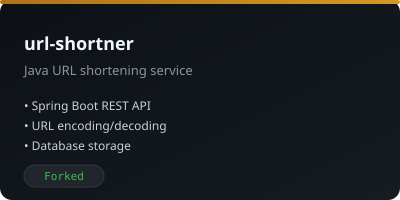
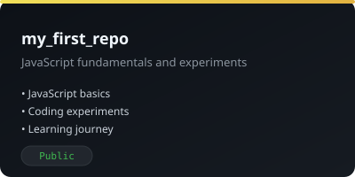
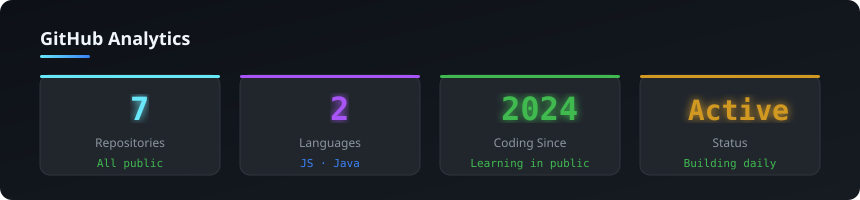
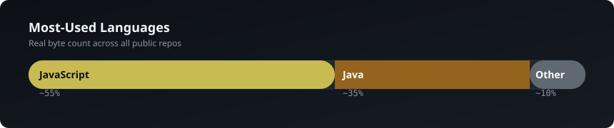

 
 

---

 
 

 

PROFILE

## Bittu Prasad Mandal — Web Developer · JavaScript · Java · HTML · CSS

SUMMARY

 

- **Web developer** — builds responsive web applications and REST APIs with JavaScript and Java, grounded in strong foundations in data structures, algorithms, and the software development lifecycle.
- **BTech CSE · Class of 2026** — Noida International University, CGPA 7.00/10.00.
- **7 public repositories** — every project built, tested, documented, and released in the open since 2024.
- **Web Development Intern** — The Developers Area (Feb–Aug 2026), hands-on with modern web stacks.
- **Junior Assistant · Techno Sales** — Subisu Pvt. Ltd. (Aug 2026 — Present).
- **YouTube educator** — shares JavaScript tutorials and coding content on the B2 Mandal channel.

 
 

---

 
 

<h3 align="center">Education</h3>

 

 
 

---

 
 

<h3 align="center">Work Experience</h3>

 

 
 

---

 
 

<h3 align="center">Selected projects — what they are, and what they are used for</h3>

 

 

 

<a href="https://github.com/ronak904?tab=repositories">View all 7 public repositories</a>

 
 

---

 
 

<h3 align="center">Live GitHub activity</h3>

 

LIVE ANALYTICS
 

 
 
 

MOST-USED LANGUAGES — REAL BYTE COUNT ACROSS ALL PUBLIC REPOS
 

 
 

---

 
 

<h3 align="center">Core technologies — the stack I build with</h3>

 

<table>
  <tr>
    <td width="150" align="center"> JavaScript</td>
    <td width="150" align="center"> Java</td>
    <td width="150" align="center"> HTML5</td>
    <td width="150" align="center"> CSS3</td>
  </tr>
  <tr>
    <td align="center"> React</td>
    <td align="center"> Node.js</td>
    <td align="center"> Spring Boot</td>
    <td align="center"> MySQL</td>
  </tr>
  <tr>
    <td align="center"> Git</td>
    <td align="center"> GitHub</td>
    <td align="center"> VS Code</td>
    <td align="center"> Maven</td>
  </tr>
</table>

 
 

---

 
 

<h3 align="center">A techie joke — fresh on every visit</h3>

 

 
 

---

 
 

<h3 align="center">Contact</h3>

 

